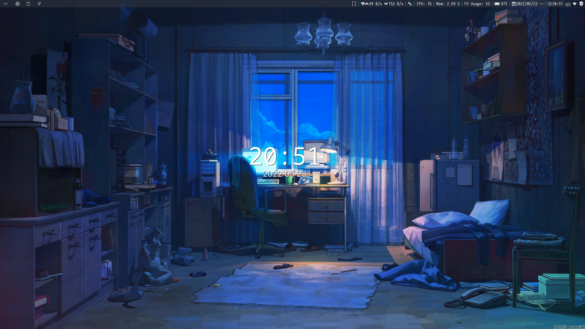
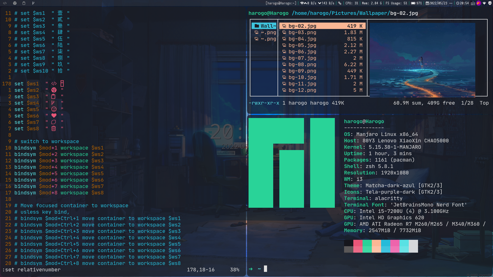
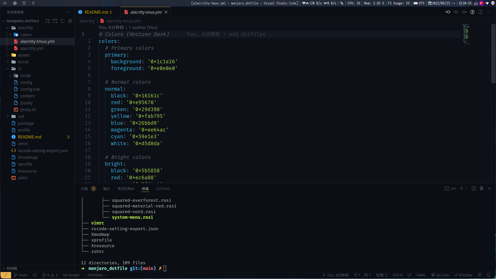
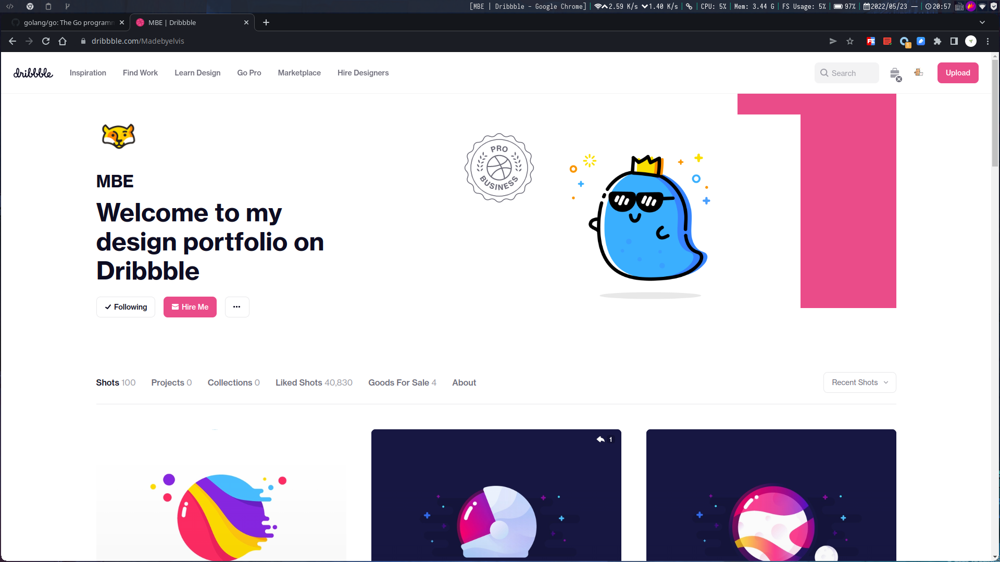
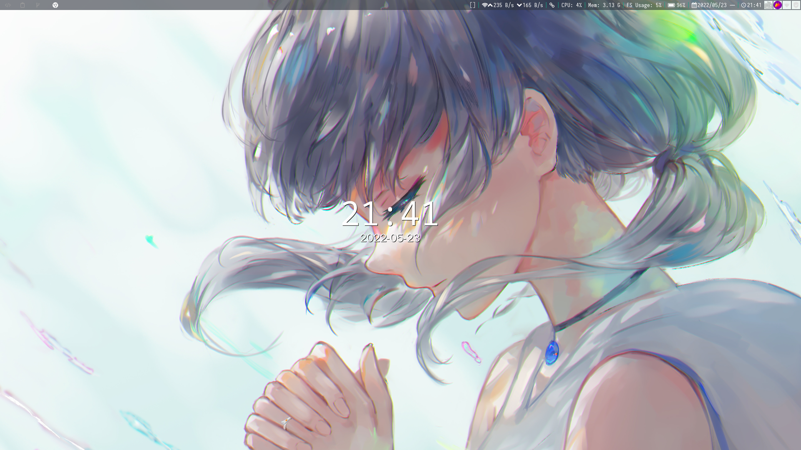

<h1 align='center'>Manjaro i3wm Config</h1>

依托于 Manjaro i3wm 社区版本身就已经较为完备的配置，此配置本身也就没有太大的修改，自己用的比较习惯。因为某代码托管平台审核机制，所以将配置简单整理重新在 github 发一个仓库。

## 软件

|    功能需求    |                                  软件                                   |
| :------------: | :---------------------------------------------------------------------: |
| 代码、文字编辑 |                           vscode、vim、neovim                           |
|    快速启动    |                    rofi，对应 rofi 文件夹中配置[^1]                     |
|       wm       | 替换原本的 `i3-gaps`，使用 `i3-gaps-rounded-git` 替换[^2]，支持窗口圆角 |
|      bar       |                              i3bar + conky                              |
|    消息通知    |                                  dunst                                  |
|    窗口透明    |                                  picom                                  |
|      截图      |                              flameshot[^3]                              |
|      图床      |                                  picgo                                  |
|    markdown    |                            `typora-free-cn`                             |
|     shell      |                                   zsh                                   |
|      终端      |                                alacritty                                |
|     输入法     |                     fcitx-sogoupinyin（搜狗输入法）                     |
|      pdf       |                                 zathura                                 |
|    正常访问    |              v2ray, proxychains-ng，能解决绝大部分《404》               |

更多内容参考 `package` 文件（使用 `pacman -Qeq` 导出，包含很多依赖包，请移除无用包选择性安装）

[^1]: 本身也是从某开源项目拿过来，拥有很多主题可以替换，在 i3 配置中对应修改即可。
[^2]: 在 Manjaro i3wm 的版本中安装时先卸载 `manjaro-i3-settings` 再进行安装；若使用原本的 `i3-gaps`，请注释 `i3/config` 中 `border_radius`（约在 426 行左右）。
[^3]: 图片复制请替换原本的 `clipit` 安装 `xclip`。

## 使用

1. 文件夹中基本可以将其移动到 `$HOME/.config` 下，存在报错可能是某些配置中路径问题;
2. `profile`、`vimrc`[^4]、`Xmodmap`[^5]、`xprofile`、`Xresource` 移动到用户家目录下并添加在前面`.`替换原本配置文件即可;
3. `vscode-setting-export` 纯 vscode 个人配置，主要用在一些不方便登录以同步设置的场景，可无视，需要使用的话 vscode 需要安装 `vscode setting export` 插件进行导入;

[^4]: 很久不用，基本没用，使用 `vim-plug` 进行插件管理
[^5]: 解决原来 61 键没有 \` 键问题

## 部分截图

Create With :heart: By Harogo

